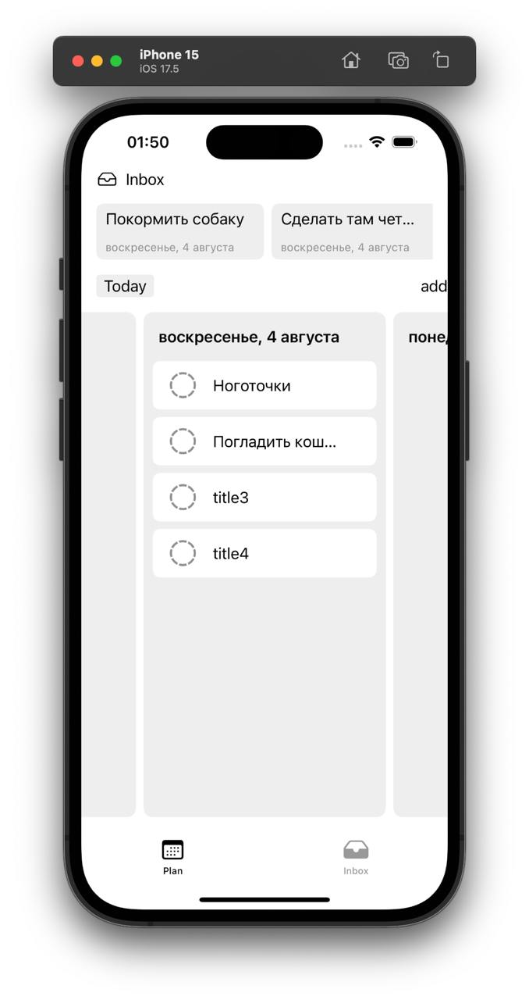

# CubicDone

  

Мобильная нативная версия приложения CubicDone

  
  

## Технологии и инструменты

- [SwiftUI](https://developer.apple.com/xcode/swiftui/)
- [SwiftLint](https://github.com/realm/SwiftLint)
